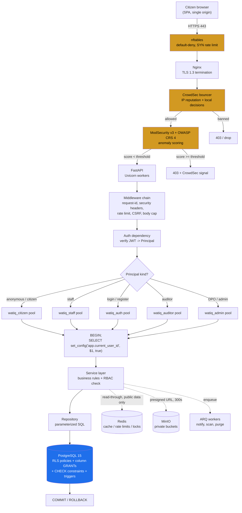
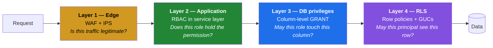

# Watiq — Architecture

> **Watiq** (وثيق) is the single national portal for Tunisia's public legal services: civil status, identity documents, transport, taxation, justice records, urbanism, and utility subscriptions.

**Companion documents**
| Document | Owns |
|---|---|
| `Architecture.md` (this file) | Technology choices, topology, trust boundaries, ADRs |
| [`Backend.md`](./Backend.md) | Application design — FastAPI, the RLS session contract, Redis caching |
| [`Structure.md`](./Structure.md) | Repository layout, layering rules, file management |
| [`Security.md`](./Security.md) | Threat model, firewall, WAF, IDS/IPS, OWASP mapping, CVE process |

---

## 1. The governing constraint

Read `Watiq.sql` before reading anything else. **The database is not a passive store — it is the innermost enforcement layer**, and it dictates the shape of everything above it.

The schema already enforces:

| Mechanism | Where in `Watiq.sql` | Consequence for the backend |
|---|---|---|
| Row-Level Security on 14 tables | §7 | The app **must** connect as a non-owner role and set session GUCs per transaction |
| Five DB roles with **column-level** GRANTs | §7b | A citizen physically cannot write `requests.status_id` — no app code required |
| RBAC consulted *inside* RLS policies | `fn_staff_has_permission()` | Permission changes are `INSERT`s into `role_permissions`, not deployments |
| `security_invoker = true` on all 7 views | §9 | Views inherit the caller's RLS; never grant a view expecting owner rights |
| Append-only `access_log` | §6, §7 | INSERT granted, SELECT not — `INSERT … RETURNING` **fails by design** |
| Trigger-owned columns | §5 | `tracking_code`, `status_id`, `appointments.office_id` are never client input |
| `fn_anonymize_user()` | §8 | `watiq_admin` only; caller must purge blob storage **first** |

Every architectural decision below either serves that constraint or gets out of its way.

---

## 2. Architectural style: modular monolith

A single deployable FastAPI application, internally partitioned into domain modules with enforced boundaries.

### Why not microservices

| Force | Verdict |
|---|---|
| **RLS session context** | In-process, this is one `set_config()` per transaction. Across services it becomes a distributed identity-propagation problem — and every hop is a chance to lose or forge `app.current_office_id`. This alone settles it. |
| **Transactional integrity** | Booking an appointment touches `appointments` + `appointment_slots` under one row lock. The overbooking guard is a `CHECK` constraint in a single transaction. Splitting services means sagas and compensating transactions to re-implement something Postgres does for free. |
| **Scale** | Tunisia is ~12M people. Peak load is a national deadline (tax declarations), which is a *read* spike on the public catalogue — solved by Redis and read replicas, not by service decomposition. |
| **Team & ops** | A government platform team should not be running a service mesh to issue birth certificates. Fewer moving parts is a security property. |
| **Deploy independence** | Real benefit of microservices, and the one we forgo. Accepted: this is one product with one release train. |

**The monolith is modular, not a ball of mud.** Module boundaries are enforced by import rules ([`Structure.md` §4](./Structure.md)) and are drawn so that a future extraction — most plausibly `notifications` or `payments` — is a refactor, not a rewrite.

---

## 3. Technology stack

### 3.1 Application

| Component | Version | Role | Why this, not the alternative |
|---|---|---|---|
| **Python** | 3.12 | Language | Mature async, `TaskGroup`/`ExceptionGroup`, per-interpreter GIL groundwork. 3.13 deferred until the C-extension ecosystem (asyncpg, argon2-cffi) is fully settled. |
| **FastAPI** | 0.115+ | Web framework | Pydantic-native validation at the boundary, OpenAPI generated from types (which `Security.md` then fuzzes with Schemathesis), first-class async. *vs Django*: we do not want an ORM-centric admin or a second, competing permission system layered over RLS. *vs Flask*: no native async, validation bolted on. |
| **Uvicorn** + **Gunicorn** | latest | ASGI server / process manager | `uvicorn.workers.UvicornWorker` under Gunicorn for pre-fork supervision, graceful reload, and worker recycling (`--max-requests` bounds memory-leak blast radius). |
| **SQLAlchemy** | 2.0 (async) | Data access | Explicit Core + typed ORM. We need hand-written SQL for the `security_invoker` views and RLS-aware queries; SQLAlchemy Core gives that without abandoning parameterization. *vs raw asyncpg*: loses composability and connection-pool events. *vs Tortoise/Piccolo*: smaller ecosystem, weaker migration story. |
| **asyncpg** | 0.30+ | Postgres driver | Fastest async Postgres driver; native `INET`, `JSONB`, prepared statements. |
| **Pydantic** | v2 | Validation / serialization | Rust core, `model_config = ConfigDict(extra="forbid")` is a security control (mass-assignment defence). |
| **pydantic-settings** | v2 | Configuration | Typed env/secret loading with fail-fast startup validation. Missing secret = refusal to boot, not a runtime `None`. |
| **Alembic** | 1.13+ | Migrations | `Watiq.sql` becomes revision `0001` verbatim; nothing is auto-generated over it. |
| **ARQ** | 0.26+ | Background jobs | Redis-native, async-first, ~1k LOC. *vs Celery*: Celery's async support is a retrofit, and it would drag in a second broker or a heavier Redis usage pattern. Redis is already a hard dependency — ARQ adds no new infrastructure. |
| **argon2-cffi** | latest | Password hashing | Argon2id, OWASP's first recommendation. *vs bcrypt*: 72-byte truncation and no memory-hardness. |
| **PyJWT** / **cryptography** | latest | Tokens, envelope encryption | EdDSA (Ed25519) access tokens; AES-256-GCM for `staff.mfa_secret`. |
| **structlog** | latest | Logging | Structured JSON with a processor chain — which is where PII redaction is enforced ([`Security.md` §14](./Security.md)). |
| **OpenTelemetry** | latest | Tracing / metrics | Vendor-neutral; exports to Tempo + Prometheus. |

### 3.2 Infrastructure

All self-hosted on Linux + Docker in national infrastructure. **No citizen data leaves sovereign hardware.**

| Component | Version | Role | Why |
|---|---|---|---|
| **PostgreSQL** | 15+ | System of record | Hard floor — `security_invoker` views require 15. Also `pgcrypto`, `pg_trgm`, RLS, generated `tsvector` columns. |
| **Redis** | 7.2+ | Cache, rate limits, locks, job queue | ACL support (7.x), TLS, `maxmemory-policy`. One dependency serving four needs. |
| **MinIO** | latest | Object storage | S3-compatible **presigned URLs** — the schema's `documents.storage_key` contract requires exactly this. *vs local filesystem*: no signed-URL primitive, no object lock, no versioning. |
| **Nginx** | 1.26+ | Reverse proxy, TLS termination | Mature, and the host for both ModSecurity and the CrowdSec bouncer. |
| **ModSecurity v3** + **OWASP CRS 4.x** | — | WAF | Signature/anomaly-scoring layer. See [`Security.md` §3](./Security.md). |
| **CrowdSec** | latest | IPS | Behavioural blocking at the Nginx bouncer. See [`Security.md` §4](./Security.md). |
| **Suricata** | 7.x | IDS | Ingress network inspection, ET Open ruleset. See [`Security.md` §5](./Security.md). |
| **Wazuh** | 4.x | HIDS / FIM / SIEM | File integrity, auditd, log correlation. See [`Security.md` §6](./Security.md). |
| **ClamAV** | latest | Malware scanning | Every citizen upload before it leaves `status = 'pending'`. |
| **nftables** | — | Host firewall | Default-deny. See [`Security.md` §2](./Security.md). |
| **Docker** + **Compose** | latest | Runtime | Chosen over Kubernetes deliberately — see ADR-004. |
| **Prometheus** / **Grafana** / **Loki** | latest | Observability | Self-hostable, no telemetry egress. |
| **pgBackRest** | latest | Backup / PITR | WAL archiving, encrypted repos, verified restores. |

---

## 4. Request lifecycle

End to end, with every trust boundary crossed:



**The point of the diagram:** an attacker must defeat *every* orange box to reach the blue one — and even then, RLS inside the blue box still refuses to return another citizen's rows.

---

## 5. Deployment topology

```mermaid
flowchart TB
    subgraph host["Docker host — government datacenter"]
        subgraph edge["network: watiq_edge (bridge)"]
            NGX["nginx + modsecurity + crowdsec-bouncer<br/><b>ports 80, 443 published</b>"]
        end

        subgraph app["network: watiq_app (internal)"]
            API["watiq-api x N<br/>FastAPI / Uvicorn"]
            WRK["watiq-worker x M<br/>ARQ"]
            AV["clamav"]
        end

        subgraph data["network: watiq_data (internal: true)"]
            PG[("postgres:15<br/>no published port")]
            RDS[("redis:7.2<br/>no published port")]
            MIN[("minio<br/>no published port")]
        end

        subgraph obs["network: watiq_obs (internal)"]
            PROM["prometheus"]
            GRAF["grafana"]
            LOKI["loki"]
            WAZ["wazuh-manager"]
        end

        SUR["suricata<br/>network_mode: host<br/>cap: NET_ADMIN, NET_RAW"]
    end

    NGX --> API
    API --> PG
    API --> RDS
    API --> MIN
    WRK --> PG
    WRK --> RDS
    WRK --> MIN
    WRK --> AV
    API -.metrics.-> PROM
    API -.logs.-> LOKI
    SUR -.eve.json.-> WAZ

    style data fill:#161b22,color:#fff
    style NGX fill:#d29922,color:#000
```

**Invariants of this topology:**

1. **Only Nginx publishes host ports.** Postgres, Redis, and MinIO have no `ports:` mapping at all — they are reachable only over the internal Docker networks. A misconfigured host firewall cannot expose them, because there is nothing bound to expose.
2. `watiq_data` is declared `internal: true`, so those containers have **no egress route to the internet**. A compromised Postgres cannot exfiltrate outward.
3. Suricata runs `network_mode: host` because it must see ingress traffic pre-NAT. It is the only container with elevated capabilities, and it holds exactly two: `NET_ADMIN`, `NET_RAW`.
4. API and worker containers are `read_only: true` with `tmpfs` for `/tmp`, run as non-root, `cap_drop: ALL`, `no-new-privileges`.

---

## 6. The four-layer authorization model

This is the single most important idea in the system. Authorization is answered **four times**, independently, by four different technologies:



| Layer | Enforced by | Fails how | Worked example |
|---|---|---|---|
| 1. Edge | ModSecurity, CrowdSec, rate limits | 403 / connection drop | 500 `POST /auth/login` from one IP → CrowdSec ban |
| 2. Application | `require_permission("request.approve")` in the service layer | 403 with a clean error body | Clerk calls the approve endpoint → rejected before SQL runs |
| 3. DB privilege | `GRANT UPDATE (status_id, …) ON requests TO watiq_staff` | `SQLSTATE 42501` insufficient privilege | Citizen connection attempts `UPDATE requests SET status_id = …` → refused at parse time |
| 4. DB rows | `CREATE POLICY … USING (user_id = app_current_user_id())` | Zero rows returned | Service forgets a `WHERE user_id = …` → other citizens' rows simply do not exist for that connection |

**Layers 2–4 are deliberately redundant.** Layer 2 gives good error messages and cheap rejection; layers 3 and 4 are the ones that hold when layer 2 has a bug. A missing `WHERE` clause is a *performance* bug in this architecture, not a data breach.

---

## 7. Trust boundaries

| Boundary | Crossing | Trust posture |
|---|---|---|
| Internet → Nginx | TLS 1.3 | **Zero trust.** Everything is hostile until CRS-scored and rate-limited. |
| Nginx → FastAPI | HTTP over `watiq_edge` | Nginx is trusted to have terminated TLS and to set `X-Forwarded-For`; FastAPI trusts **only** the last proxy hop (`ProxyHeadersMiddleware` with an explicit trusted-hosts list). Never trust a client-supplied `X-Forwarded-For`. |
| FastAPI → Postgres | TLS, `scram-sha-256` | The app is **semi-trusted**. It authenticates as a limited role and asserts identity via GUCs. The schema itself notes the limit: an attacker who can execute arbitrary SQL on the connection can `SET` a different office id. That is why layer 1 and injection defence matter even with RLS. |
| FastAPI → Redis | TLS, per-component ACL user | Redis holds **no PII by policy** (see [`Backend.md` §5](./Backend.md)). Compromise costs cache poisoning and rate-limit bypass — bad, not catastrophic. |
| FastAPI → MinIO | TLS, scoped access key | Buckets are private. Objects reachable only through 300-second presigned GETs issued after an authz check. |
| Staff browser → API | Same as citizen, **plus TOTP MFA** | Staff can read CIN numbers and ID scans. A password alone is not an acceptable authenticator, and the schema encodes this (`staff.mfa_secret`, `staff_recovery_codes`). |
| Operator → host | SSH, key-only, bastion | Highest-privilege boundary and the largest residual risk — see [`Security.md` §17](./Security.md). |

---

## 8. Data classification

| Class | Data | Handling |
|---|---|---|
| **Public** | `service_catalog`, `categories`, `offices`, `request_statuses`, `priorities` | Cacheable in Redis globally, CDN-safe, no authz needed |
| **Internal** | `appointment_slots` capacity, `v_office_workload` | Authenticated read; short-TTL cache |
| **Confidential** | `users` PII, `requests.form_data`, `payments`, `appointments` | RLS-scoped, **never cached**, access recorded in `access_log` |
| **Restricted** | `documents` (CIN/passport scans), `national_id` | Confidential + presigned-URL-only + malware-scanned + masked in views via `fn_mask_tail()` |
| **Secret** | `password_hash`, `mfa_secret`, `refresh_token_hash`, `code_hash` | Never leaves the DB, never logged, never in any API response, excluded from every role's SELECT grant except `watiq_auth` |

The schema enforces the bottom row itself: `GRANT SELECT (…)` on `staff` for `watiq_staff` deliberately omits `password_hash` and `mfa_secret`, and §7b explains *why* enumerated column grants are the only way to withhold a column in Postgres.

---

## 9. Architecture Decision Records

### ADR-001 — Application connects as five distinct DB roles, never as the schema owner
**Status:** Accepted · **Drivers:** `Watiq.sql` §7

RLS does not apply to table owners or superusers. Connecting as the owner silently disables *every* policy in section 7 — the security model would appear present and be entirely inert.

**Decision:** five `AsyncEngine` instances (`watiq_citizen`, `watiq_staff`, `watiq_auth`, `watiq_auditor`, `watiq_admin`), each with its own pool and login user. The migration user is separate again and is never used to serve traffic.

**Consequences:** ~5× connection-pool footprint (mitigated by small per-role pool sizes, and PgBouncer in `transaction` mode if needed). A CI test asserts that no runtime engine can `SELECT` a row it should not — see [`Security.md` §16](./Security.md).

---

### ADR-002 — Session identity via `set_config(..., true)` with bind parameters
**Status:** Accepted · **Drivers:** `Watiq.sql` §7 operational note

`SET LOCAL app.current_user_id = '123'` cannot take a bind parameter, which invites string interpolation — an SQL injection vector at the exact point where identity is established. The functional equivalent `set_config(name, value, is_local)` is an ordinary function call and **can** be parameterized.

**Decision:** identity is set with `SELECT set_config('app.current_user_id', :uid, true)`. `is_local = true` scopes it to the transaction, so a pooled connection cannot carry one citizen's identity into the next request.

**Consequences:** every RLS-bearing query must run inside an explicit transaction. Enforced by a single FastAPI dependency; f-string SQL is banned by a Semgrep rule.

---

### ADR-003 — Redis caches public data only
**Status:** Accepted

Caching an RLS-scoped row means re-implementing RLS in the cache key. Get the namespacing subtly wrong once and one citizen is served another citizen's request from cache — a breach with no database query to audit and nothing in `access_log`.

**Decision:** only RLS-independent, publicly-readable data is cached (catalogue, lookups, office directory, slot counts). Citizen PII, requests, documents, and payments are **never** cached. Full table in [`Backend.md` §5](./Backend.md).

**Consequences:** per-citizen reads always hit Postgres. Accepted — those are indexed point lookups, and the expensive workload (national catalogue search) is exactly what *is* cached.

---

### ADR-004 — Docker Compose, not Kubernetes
**Status:** Accepted

**Decision:** Compose on a small number of hardened hosts, with Nginx load-balancing across API replicas.

**Rationale:** the load profile does not require elastic scaling; a national platform team is better served by a topology it can fully reason about; and Kubernetes' own attack surface (API server, RBAC, admission control, CNI, etcd) is a substantial security burden that must itself be hardened. Fewer moving parts is a security property.

**Consequences:** manual scaling, self-managed rolling deploys. Revisit if sustained load or multi-datacenter HA demands it — the container images are unchanged either way, so this is a migration of orchestration, not of application code.

---

### ADR-005 — Opaque refresh tokens, not stateless refresh JWTs
**Status:** Accepted · **Drivers:** `Watiq.sql` `sessions` table

`sessions.refresh_token_hash` with `revoked_at` / `revoked_reason` exists precisely so that revoking a departing employee's access is an `UPDATE`, not a password reset. A stateless refresh JWT cannot be revoked before expiry and would render that table decorative.

**Decision:** short-lived (15 min) EdDSA access JWTs; long-lived refresh tokens are opaque 256-bit random values, stored only as SHA-256 hashes, rotated on every use, with reuse detection revoking the entire session family.

**Consequences:** one Redis-or-Postgres lookup per refresh (every 15 min per session — negligible). Buys instant revocation, a per-device session list for citizens, and stolen-token detection.

---

### ADR-006 — `service_catalog` / `office_services` split is load-bearing for the API
**Status:** Accepted (inherited from the schema) · **Drivers:** `Watiq.sql` §3

The schema splits national service definitions from per-office delivery. This is not a normalization nicety — it is what makes `/services/{slug}` a single clean national URL instead of 350 duplicates, and what makes `v_service_availability` able to resolve `COALESCE(os.fee_override, sc.base_fee)` in one place.

**Decision:** the API mirrors the split exactly. `/services/…` is national and cacheable; `/services/{slug}/offices` is the "where can I actually get this, and what will it cost here" endpoint. **The fee/SLA override rule is never re-implemented in Python** — it is read from `v_service_availability`.

**Consequences:** one source of truth for effective fee and effective SLA. Two endpoints where a naive design would have one.

---

## 10. Scaling path

Ordered by what actually breaks first:

1. **Redis cache** absorbs national catalogue search — the dominant read workload. Already in the design.
2. **API replicas** scale horizontally; the app is stateless (no in-process session state, all shared state in Redis/Postgres).
3. **Postgres read replicas** for `watiq_auditor` and reporting views, keeping analytics off the primary. RLS and `security_invoker` work identically on replicas.
4. **PgBouncer** in `transaction` pooling mode if connection count from five pools × N replicas becomes the constraint. Compatible with `set_config(..., true)` precisely because it is transaction-scoped.
5. **Partition `access_log`** by month (`BIGSERIAL`, append-only, grows fastest of any table).
6. **Extract a service** — `notifications` first, as it is the only module with a genuinely different scaling profile (bursty fan-out) and the weakest transactional coupling.
