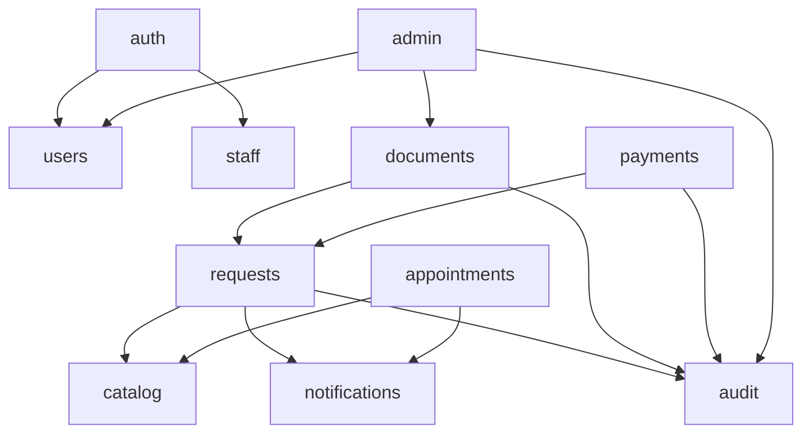

# Watiq — Repository Structure & File Management

**Companion documents:** [`Architecture.md`](./Architecture.md) · [`Backend.md`](./Backend.md) · [`Security.md`](./Security.md)

---

## 1. Top level

```
ProjectBeta/
├── Watiq.sql                     # THE SCHEMA. Source of truth. See §6.
├── Architecture.md
├── Backend.md
├── Structure.md
├── Security.md
├── README.md
├── .env.example                  # every key, no real values
├── .gitignore
├── docker-compose.yml            # dev
├── docker-compose.prod.yml       # prod overlay: secrets, hardening, replicas
├── Makefile                      # canonical commands (§9)
│
├── backend/                      # the FastAPI monolith
├── ops/                          # infrastructure config (nginx, WAF, IDS/IPS)
└── docs/
    ├── adr/                      # ADR-001.md … (Architecture.md carries summaries)
    ├── runbooks/                 # incident response, restore drill, offboarding
    └── openapi.json              # exported in CI, diffed to catch breaking changes
```

---

## 2. `backend/`

```
backend/
├── pyproject.toml
├── uv.lock                       # hash-pinned; the only dependency source of truth
├── alembic.ini
├── Dockerfile                    # multi-stage, non-root, distroless runtime
├── .dockerignore
│
├── app/
│   ├── __init__.py
│   ├── main.py                   # app factory, middleware order, lifespan, routers
│   │
│   ├── core/                     # cross-cutting. Imported by everything.
│   │   ├── config.py             # Settings (pydantic-settings), fail-fast
│   │   ├── db.py                 # 5 engines + rls_transaction()  ← 100% coverage
│   │   ├── principal.py          # Principal dataclass
│   │   ├── deps.py               # DbConn, CurrentUser, require_permission()
│   │   ├── redis.py              # client factory, ACL user, TLS
│   │   ├── cache.py              # cached(), namespace versioning, stampede lock
│   │   ├── ratelimit.py          # sliding window; FAILS CLOSED
│   │   ├── idempotency.py        # Idempotency-Key handling for payments
│   │   ├── security.py           # Argon2id, JWT mint/verify, CSRF
│   │   ├── crypto.py             # AES-256-GCM envelope for staff.mfa_secret
│   │   ├── storage.py            # MinIO/S3 presigned PUT & GET
│   │   ├── errors.py             # exception types + CONSTRAINT_ERRORS map
│   │   ├── exception_handlers.py # RFC 9457 problem+json responses
│   │   ├── logging.py            # structlog chain incl. PII redaction processor
│   │   ├── middleware.py         # request-id, security headers, body cap
│   │   ├── pagination.py         # cursor pagination helpers
│   │   └── telemetry.py          # OpenTelemetry setup
│   │
│   ├── modules/                  # domain modules — see §3
│   │   ├── auth/
│   │   ├── users/
│   │   ├── staff/
│   │   ├── catalog/
│   │   ├── requests/
│   │   ├── documents/
│   │   ├── appointments/
│   │   ├── payments/
│   │   ├── notifications/
│   │   ├── audit/
│   │   └── admin/
│   │
│   ├── workers/
│   │   ├── settings.py           # ARQ WorkerSettings, cron schedule
│   │   └── tasks/
│   │       ├── documents.py      # scan_document
│   │       ├── notifications.py  # send_notification
│   │       ├── maintenance.py    # fn_purge_expired_auth_artifacts, no-shows
│   │       └── security.py       # detect_anomalous_access
│   │
│   └── db/
│       ├── migrations/
│       │   ├── env.py            # runs as the migration user, NEVER an app role
│       │   └── versions/
│       │       ├── 0001_baseline_watiq_schema.py   # executes Watiq.sql verbatim
│       │       └── 0002_....py
│       └── sql/
│           └── watiq_baseline.sql  # symlink/copy of ../../Watiq.sql — see §6
│
└── tests/
    ├── conftest.py               # testcontainers Postgres + Redis fixtures
    ├── factories/
    ├── unit/
    ├── integration/
    └── security/
        ├── test_rls_isolation.py       # ← the load-bearing suite
        ├── test_column_grants.py
        ├── test_authz_matrix.py
        └── test_no_pii_in_cache.py
```

---

## 3. Anatomy of a module

Every module in `app/modules/` has the same six files. Uniformity means a developer can open any module and already know where things are.

```
app/modules/requests/
├── __init__.py
├── router.py            # HTTP only: paths, status codes, dependencies
├── schemas.py           # Pydantic request/response models
├── service.py           # business rules, authorization, transaction orchestration
├── repository.py        # SQL only
├── models.py            # SQLAlchemy Table/ORM definitions
├── exceptions.py        # module-specific errors -> mapped in core/errors.py
└── formschemas/         # (requests module only) JSON Schema per service code
    ├── civil.birth_certificate.json
    └── identity.cin_renewal.json
```

### Responsibilities, strictly

| File | May import | **May not** |
|---|---|---|
| `router.py` | `schemas`, `service`, `core.deps` | **SQLAlchemy, `repository`, raw SQL** |
| `service.py` | `repository`, `schemas`, other modules' `service` | `fastapi.Request`/`Response`, HTTP status codes |
| `repository.py` | `models`, `sqlalchemy` | `schemas`, `service`, business rules |
| `schemas.py` | `pydantic` | anything from `service`/`repository` |

**Why the router may not touch SQL:** the RLS transaction is opened by the `DbConn` dependency and must wrap the *whole* unit of work. A router that runs its own query would either run outside that transaction (losing the session GUCs entirely — every RLS policy evaluates against `NULL` and returns nothing) or open a second one.

**Why the service may not touch `Request`/`Response`:** services are what the ARQ workers call. A service that reaches for an HTTP request cannot run in a background job.

---

## 4. Import rules

Enforced by `import-linter` in CI, not by convention.

```ini
# backend/.importlinter
[importlinter]
root_package = app

[importlinter:contract:layers]
name = Layered architecture
type = layers
layers =
    app.modules
    app.core
containers = app

[importlinter:contract:module-independence]
name = Modules talk through services only
type = forbidden
source_modules =
    app.modules.requests
    app.modules.appointments
    app.modules.payments
    app.modules.documents
    app.modules.notifications
    app.modules.catalog
    app.modules.users
forbidden_modules =
    app.modules.*.repository
    app.modules.*.models
allow_indirect_imports = false

[importlinter:contract:routers-are-thin]
name = Routers must not import SQLAlchemy
type = forbidden
source_modules = app.modules.*.router
forbidden_modules = sqlalchemy
```

Three rules, in plain language:

1. **`core` never imports `modules`.** Core is infrastructure; a cycle here means infrastructure has grown a domain opinion.
2. **A module may call another module's `service`, never its `repository` or `models`.** Cross-module SQL is how a monolith becomes a ball of mud and how a future service extraction becomes impossible.
3. **Routers never import SQLAlchemy.** See §3.

Permitted cross-module dependencies (a directed acyclic graph):



`audit` and `notifications` are leaves — they depend on nothing. `catalog` depends on nothing. That is deliberate: they are the three modules most likely to be extracted or reused.

---

## 5. Naming conventions

| Thing | Convention | Example |
|---|---|---|
| Module directory | singular or plural to match the table | `requests/`, `catalog/` |
| Pydantic input | `<Noun>In` / `<Verb><Noun>In` | `RequestCreateIn`, `LoginIn` |
| Pydantic output | `<Noun>Out` | `RequestOut`, `ServiceDetailOut` |
| Repository function | verb-first, states what SQL it runs | `find_session_by_refresh_hash`, `list_storage_keys_for_user` |
| Service function | verb-first, states the business action | `approve`, `anonymize_citizen`, `rotate_refresh` |
| SQL text constant | `_UPPER_SNAKE` at module top | `_INSERT_ACCESS_LOG` |
| Cache key builder | `wtq:{version}:{namespace}:{discriminator}` | `wtq:7:catalog:svc:permis-de-conduire` |
| ARQ task | `verb_noun` | `scan_document`, `send_notification` |
| Test | `test_<what>_<condition>_<expectation>` | `test_citizen_cannot_read_other_citizens_requests` |
| Alembic revision | `NNNN_snake_case_summary` | `0002_add_service_catalog_tags` |

**Field names mirror the schema exactly.** `national_id` never becomes `cin` or `nationalId` in a Python model. Renaming across the boundary is how a column-grant mismatch hides until production.

Soft limits, enforced by review not by tooling: ~400 lines per file, ~50 per function. A `service.py` past 400 lines usually means two modules wearing one coat.

---

## 6. Where `Watiq.sql` lives and how migrations work

`Watiq.sql` stays at the repository root as the **canonical, human-readable schema document**. Its extensive comments explain *why* each constraint exists and are part of the project's security documentation.

Alembic treats it as the immutable baseline:

```python
# backend/app/db/migrations/versions/0001_baseline_watiq_schema.py
"""Baseline: apply Watiq.sql verbatim.

This revision is never edited. Every subsequent schema change is its own
revision. Watiq.sql at the repo root remains the readable reference; this
file is how it reaches a database.
"""
from pathlib import Path
from alembic import op

revision = "0001"
down_revision = None

_SQL = Path(__file__).parents[2] / "sql" / "watiq_baseline.sql"


def upgrade() -> None:
    op.execute(_SQL.read_text(encoding="utf-8"))


def downgrade() -> None:
    raise NotImplementedError("The baseline is not reversible. Restore from backup.")
```

Rules:

1. **`0001` is never modified.** Not to fix a typo, not to add a column. Existing databases have already run it.
2. **No `--autogenerate` over the baseline.** Alembic cannot see RLS policies, column-level GRANTs, `security_invoker`, or `SECURITY DEFINER` functions; autogenerate would happily propose dropping them. All migrations after `0001` are hand-written.
3. **Migrations run as the migration user**, which owns the schema. Application roles have no DDL privilege. `env.py` asserts this and aborts if the configured DSN matches any app-role DSN.
4. **A new table means new GRANTs and new policies.** A migration that adds a table without `ENABLE ROW LEVEL SECURITY`, without policies, and without explicit column grants is incomplete — a table with RLS enabled and no policy is invisible to app roles, and a table without RLS is visible in full. A CI check (§8) fails the build on either.
5. `backend/app/db/sql/watiq_baseline.sql` is kept byte-identical to the root `Watiq.sql`; CI diffs them.

---

## 7. `ops/`

```
ops/
├── nginx/
│   ├── nginx.conf                # worker/TLS/log core
│   ├── conf.d/watiq.conf         # server block, proxy, rate limit zones
│   └── snippets/
│       ├── security-headers.conf # CSP, HSTS, X-Frame-Options, …
│       └── tls.conf              # TLS 1.3 ciphers, OCSP stapling
├── modsecurity/
│   ├── modsecurity.conf          # engine, body limits, audit log
│   ├── crs-setup.conf            # OWASP CRS 4.x paranoia + anomaly thresholds
│   └── rules/
│       ├── 00-watiq-exclusions.conf   # AR/FR UTF-8 + JSONB false-positive tuning
│       └── 99-watiq-custom.conf       # app-specific rules
├── crowdsec/
│   ├── acquis.yaml
│   ├── profiles.yaml
│   └── scenarios/watiq.yaml      # login brute force, tracking-code enumeration
├── suricata/
│   ├── suricata.yaml
│   └── rules/watiq.rules
├── wazuh/
│   ├── ossec.conf                # FIM on /app, auditd, container escape
│   └── rules/watiq_rules.xml
├── nftables/
│   └── watiq.nft                 # default-deny host firewall
├── postgres/
│   ├── postgresql.conf           # TLS, logging, timeouts, pgaudit
│   ├── pg_hba.conf               # scram-sha-256, per-role host rules
│   └── init/00-create-login-roles.sql   # LOGIN users granted the NOLOGIN roles
├── redis/
│   ├── redis.conf                # protected-mode, TLS, renamed commands
│   └── users.acl                 # per-component ACL users
└── backup/
    ├── pgbackrest.conf
    └── restore-drill.sh          # scheduled, and its output is checked
```

Every file in `ops/` is version-controlled and reviewed like application code. **No secrets live here** — values come from Docker secrets at `/run/secrets/` (`.gitignore` covers `*.key`, `*.pem`, `.env`, `secrets/`).

### 7.1 A note on `ops/postgres/init/`

`Watiq.sql` §7 creates five **`NOLOGIN`** roles. Those are permission bundles, not accounts. A separate init script creates the actual login users and grants them the bundles:

```sql
-- ops/postgres/init/00-create-login-roles.sql
CREATE USER watiq_app_citizen  LOGIN PASSWORD :'citizen_pw'  IN ROLE watiq_citizen;
CREATE USER watiq_app_staff    LOGIN PASSWORD :'staff_pw'    IN ROLE watiq_staff;
CREATE USER watiq_app_auth     LOGIN PASSWORD :'auth_pw'     IN ROLE watiq_auth;
CREATE USER watiq_app_auditor  LOGIN PASSWORD :'auditor_pw'  IN ROLE watiq_auditor;
CREATE USER watiq_app_admin    LOGIN PASSWORD :'admin_pw'    IN ROLE watiq_admin;

-- None of these own anything, so RLS applies to all of them.
-- The schema owner (watiq_migrate) is separate and never serves traffic.
ALTER ROLE watiq_app_citizen  CONNECTION LIMIT 40;
ALTER ROLE watiq_app_staff    CONNECTION LIMIT 40;
ALTER ROLE watiq_app_auth     CONNECTION LIMIT 15;
ALTER ROLE watiq_app_auditor  CONNECTION LIMIT 10;
ALTER ROLE watiq_app_admin    CONNECTION LIMIT 5;
```

The `NOLOGIN`/`LOGIN` split is what makes ADR-001 workable and is easy to get wrong — connecting as the owner would silently disable every policy in the schema.

---

## 8. CI checks tied to structure

| Check | Tool | Fails when |
|---|---|---|
| Layering & module independence | `import-linter` | A router imports SQLAlchemy; a module imports another's repository |
| Formatting & lint | `ruff` | Style drift |
| Types | `mypy --strict` on `app/core/`, standard elsewhere | Untyped boundary |
| No f-string SQL | `semgrep` custom rule | `text(f"...")` or `execute(f"...")` anywhere |
| Baseline integrity | `diff Watiq.sql backend/app/db/sql/watiq_baseline.sql` | The two copies drift |
| Migration completeness | custom script | A new table lacks RLS + policies + explicit grants |
| No secrets committed | `gitleaks` | A key, token, or password appears in a diff |
| OpenAPI drift | `oasdiff` against `docs/openapi.json` | An undeclared breaking API change |
| **RLS isolation** | `pytest tests/security/` | Any cross-principal read succeeds |

---

## 9. Makefile — the canonical commands

```makefile
.PHONY: up down migrate test test-security lint scan fmt

up:              ## dev stack
	docker compose up -d --build

migrate:         ## run as the migration user, never an app role
	docker compose exec api alembic upgrade head

test:
	docker compose exec api pytest -q

test-security:   ## the RLS regression suite — must pass before any merge
	docker compose exec api pytest tests/security/ -v

lint:
	ruff check backend && ruff format --check backend
	mypy backend/app/core --strict
	lint-imports --config backend/.importlinter

scan:            ## see Security.md §12
	pip-audit -r backend/requirements.lock
	bandit -r backend/app -ll
	semgrep --config=p/python --config=ops/semgrep/watiq.yml backend/
	trivy image watiq-api:latest --severity HIGH,CRITICAL --exit-code 1
	gitleaks detect --no-git

fmt:
	ruff format backend && ruff check --fix backend
```

---

## 10. File management conventions

- **One concern per file.** If `service.py` handles both request workflow and document verification, split it — the module boundary was drawn wrong.
- **SQL lives in `repository.py`**, as named `text()` constants at module top, never inline in a function body. This makes every query in the system greppable, which matters for security review.
- **No `utils.py`.** It becomes a landfill. Name the concern: `pagination.py`, `crypto.py`, `masking.py`.
- **No business logic in `models.py`.** SQLAlchemy models describe tables; the schema's triggers and constraints already own the invariants.
- **`__init__.py` stays empty** except in `app/modules/<m>/`, where it may re-export the router. Import side effects make test isolation unreliable.
- **Generated files are never hand-edited**: `uv.lock`, `docs/openapi.json`, `0001_baseline_watiq_schema.py`.
- **Anything added under `ops/` gets a comment explaining *why*.** `Watiq.sql` sets that standard — its comments are the reason the security model is auditable — and the infrastructure config should meet it.
